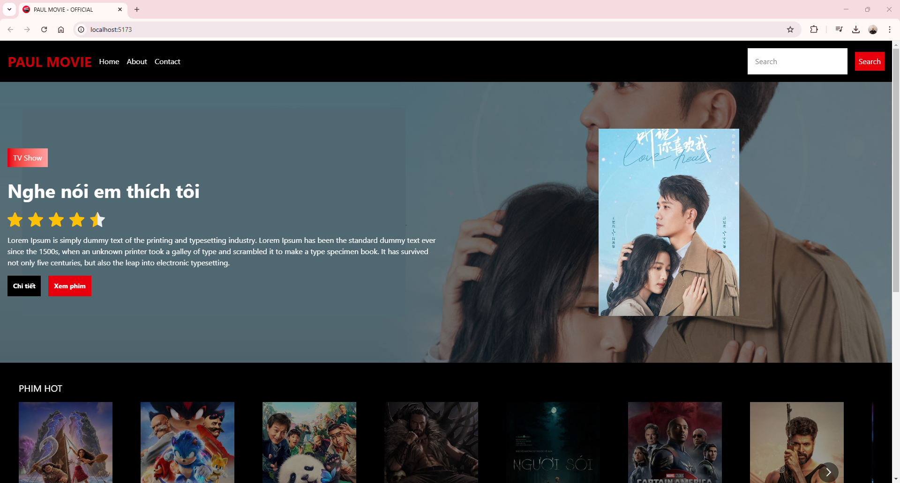
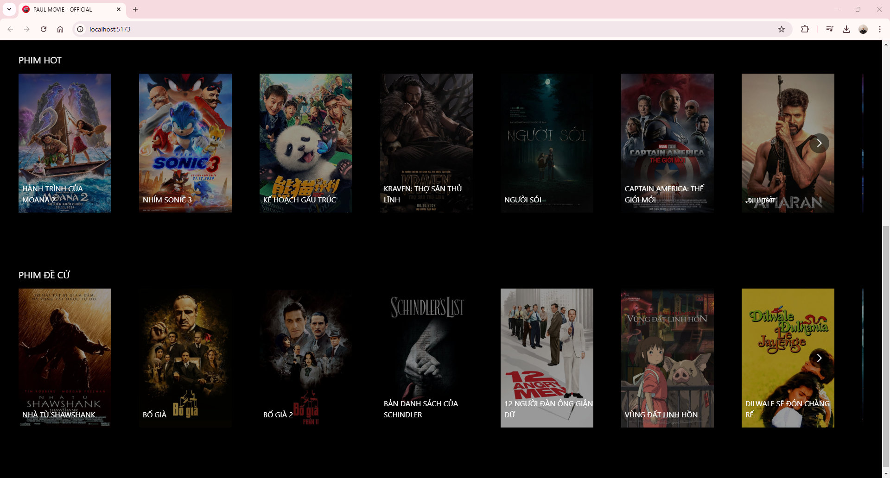
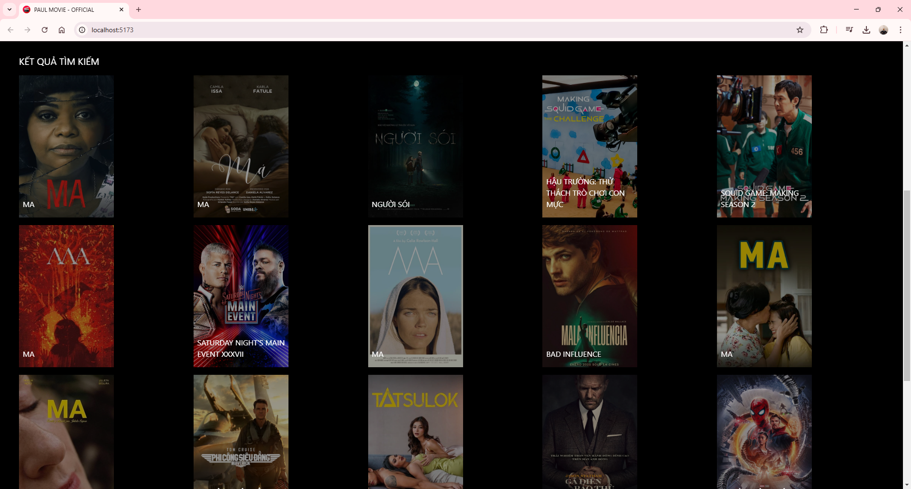

# Movie App

## Giới thiệu
Movie App là một ứng dụng web giúp người dùng tìm kiếm, xem thông tin chi tiết về các bộ phim và lưu vào danh sách yêu thích. Ứng dụng được xây dựng bằng ReactJS và tích hợp với API để lấy dữ liệu phim.

## Tính năng
- Tìm kiếm phim theo tên
- Xem thông tin chi tiết của phim
- Lưu phim vào danh sách yêu thích
- Hiển thị danh sách phim phổ biến
- Responsive trên nhiều thiết bị

## Công nghệ sử dụng
- **ReactJS**: Thư viện JavaScript để xây dựng giao diện
- **Vite**: Công cụ build nhanh chóng
- **SCSS**: Hỗ trợ viết CSS hiệu quả
- **React Router**: Quản lý điều hướng
- **Axios**: Gửi yêu cầu API
- **TMDb API**: Lấy dữ liệu phim

## Cài đặt và chạy dự án
### 1. Clone repo
```sh
git clone https://github.com/your-username/movie-app.git
cd movie-app
```

### 2. Cài đặt dependencies
```sh
npm install
```

### 3. Cấu hình API Key
Tạo file `.env` trong thư mục gốc và thêm API Key từ [TMDb](https://www.themoviedb.org/):
```sh
VITE_TMDB_API_KEY=your_api_key_here
```

### 4. Chạy ứng dụng
```sh
npm run dev
```
Mở trình duyệt và truy cập `http://localhost:5173/`

## Đóng góp
Nếu bạn muốn đóng góp, hãy tạo pull request hoặc mở issue trên GitHub.

## Giấy phép
Dự án này được phát hành dưới giấy phép MIT.

